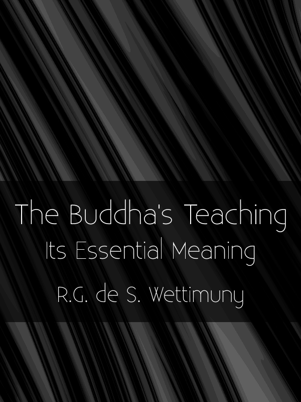

= The Buddha's Teaching
:booktitle: {doctitle}
:description: Its Essential Meaning
:author: R.G. de S. Wettimuny
:creator: {author}
:version: v1.0
:revdate: 2021-09-18
:doctype: book
:lang: en
:keywords: Wettimuny, Dhamma, Buddhism, RELIGION / Buddhism / Theravada
:copyright: CC-BY-NC-ND 4.0
:isbn: 000-0-00000-000-0
:identifier: isbn:{isbn}
:imagesdir: assets/photos/92dpi-ebook-sRGB
:includes: manuscript/asciidoc
:front-cover-image: 
:toc: left
:toc-title: Contents
:toclevels: 0

include::{includes}/preface.adoc[]

include::{includes}/titlepage.adoc[]

include::{includes}/ch-01-grasping.adoc[]
include::{includes}/ch-02-consciousness.adoc[]
include::{includes}/ch-03-name-and-form-and-consciousness.adoc[]
include::{includes}/ch-04-tanha-and-bhava.adoc[]
include::{includes}/ch-05-kamma.adoc[]
include::{includes}/ch-06-sankhara.adoc[]
include::{includes}/ch-07-holding-to-belief-in-self.adoc[]
include::{includes}/ch-08-impermanence.adoc[]
include::{includes}/ch-09-all-things-are-not-self.adoc[]
include::{includes}/ch-10-birth-decay-and-death.adoc[]
include::{includes}/ch-11-suffering.adoc[]
include::{includes}/ch-12-ignorance.adoc[]
include::{includes}/ch-13-nibbana.adoc[]
include::{includes}/ch-14-the-puthujjana-sekha-and-asekha.adoc[]
include::{includes}/ch-15-rebirth.adoc[]
include::{includes}/ch-16-satipatthana.adoc[]

include::{includes}/ch-99-appendix.adoc[]

include::{includes}/ch-99-an-3-33-sariputta.adoc[]

include::{includes}/copyright.adoc[]

